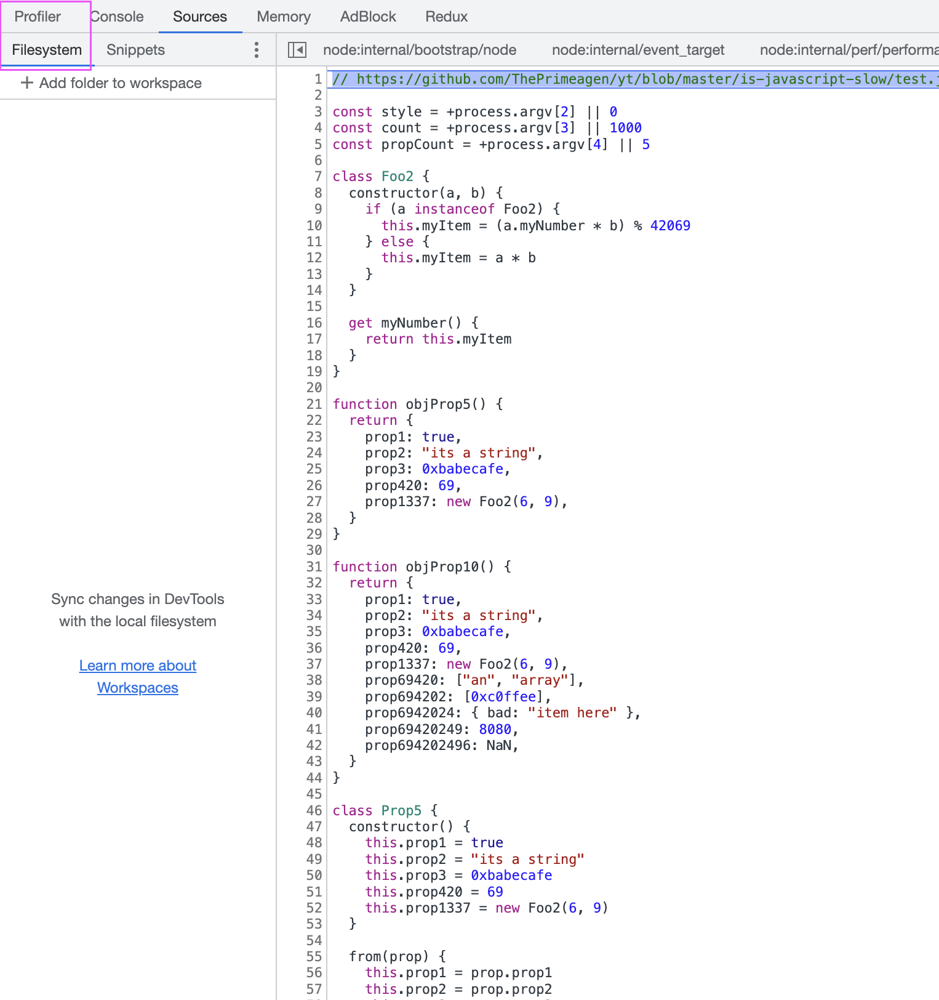
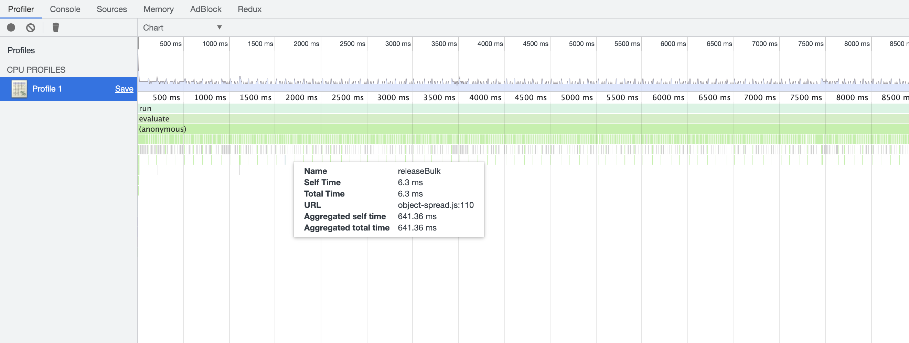

# Garbage Collection

Garbage collection prevents anything else from happening and has a significant overhead. Reusing objects can be
a good strategy to reduce memory usage.

frequent garbage collection:

```bash
npm run garbage-collection
```

Less garbage collection:

```bash
no-garbage-collection
```

## step 1


## step 2



## step 3


## step 4


## step 5


